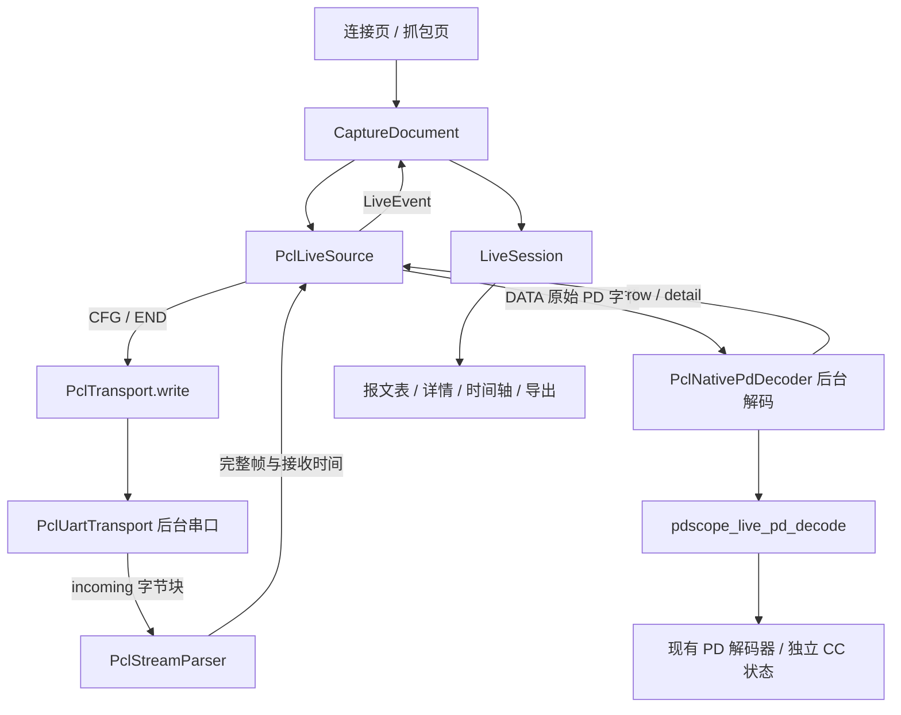
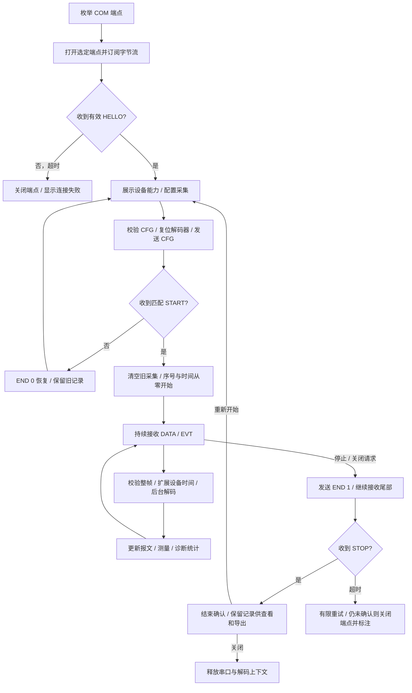

# PCL 上位机 PD 抓包适配

## 1. 使用方式

Windows 上位机默认使用 PCL UART 设备源，参数为 921600 baud、8 个数据位、
无校验、1 个停止位，无软硬件流控。参数对应当前 `embedded/ch32x035` 固件。
串口读写和 PD 核心解码分别在后台 isolate 中运行。

1. 连接 CH32X035 的 UART 与 USB 串口转换器，启动 PDScope。
2. 点击顶栏连接图标、文件菜单「连接设备…」或按 `Ctrl+D`。
3. 查找设备并选择对应 COM 端点。COM 枚举不代表端点已经确认为 PCL 设备。
4. 点击连接，等待有效 `HELLO`。页面显示固件版本、时基和已确认能力。
5. 设置采集选项，点击「开始采集」。上位机发送 `CFG`，收到匹配的 `START` 后进入采集中。
6. 点击「停止」发送 `END(flush=1)`，接收尾部 DATA/EVT，直到设备发送 `STOP`。

停止后保留报文供筛选、查看和导出。「采集配置」可修改下一次配置；仅在新 `START`
确认后清除旧采集记录，配置拒绝或启动失败保留旧记录。关闭标签或窗口先停止采集、
关闭端点并释放解码上下文。设备断开或异常时保留已采记录，不自动重连或续采。

未验证端点可以进行零写监听，监听期间只接收字节，不发送 `CFG`、`END` 或探测命令。
正常连接时若收到旧采集的 DATA/EVT，上位机发送一次 `END(flush=0)`，等待 `HELLO`
后再允许配置。

## 2. 页面选项

| 选项 | 行为 |
| --- | --- |
| PD 报文 | 当前页面配置 `CFG.mode.bit0=1` |
| 母线电压 | HELLO 声明电压能力后可选；数据来自 MEASUREMENT |
| 母线电流 | HELLO 声明电流能力后可选；CH32X035 当前固件未声明此项 |
| ADC 最短采样周期 | 请求设备采样周期，不用于轮询；不得小于 HELLO 声明下限 |
| GoodCRC 过滤 | 设备声明过滤能力后可选，映射到 CFG 选项 |
| 数据通道 | 自动、CC1、CC2、CC1+CC2；按设备 CC 选择和双 CC 能力启用 |

协议没有暂停/恢复命令。停止后重新开始是一次新采集，帧序号和设备相对计时重新从零开始。

## 3. 模块与接口

| 模块 | 职责与入口 |
| --- | --- |
| `PclTransport` | 通用有序字节传输接口：`enumerate/open/incoming/write/close` |
| `PclUartTransport` | Windows COM 枚举及后台 Win32 UART 读写；写入前复制输入，读出前复制原生缓冲 |
| `PclStreamParser` | 拼接任意读取块，校验长度和 CRC16，独立持有完整帧 |
| `PclHello/PclConfig/PclData/PclEvents` | HELLO 能力交叉校验、CFG 组装、DATA/EVT 原子验证 |
| `PclTickClock` | 根据设备时基扩展 u32 相对计数，处理回绕与小幅时间乱序 |
| `PclLiveSource` | `connect/start/stop/disconnect`，发送 CFG/END，处理设备单向事件及采集状态 |
| `PclPdDecoder` | 异步 `reset/decodeBatch/close`，可注入测试实现 |
| `PclNativePdDecoder` | 后台调用实时 PD C ABI，复制 JSON 后释放原生输入与输出 |
| `LiveSession` | 有界报文、详情、测量、日志存储及筛选、查询、快照导出 |
| `CaptureDocument` | 页面操作、START 后清空旧记录、异步状态与界面刷新 |

当前可直接使用的硬件传输为 Windows UART。HID、WinUSB bulk 和 USB CDC 可通过
实现 `PclTransport` 接入；这些 USB 设备后端尚未实现。协议层提供 HID 有效长度提取，
帧重组不依赖 HID 报告、bulk 事务或 UART 读取边界。当前页面和设备源只启动 PD 模式；
DPDM 记录布局保留在协议校验层。

实时核心接口与文件解码接口独立，原有应用版本、PCL 版本、schema 和 ABI 版本保持不变。

| C ABI | 所有权与用途 |
| --- | --- |
| `pdscope_live_pd_create` | 创建解码句柄，由一个后台线程独占 |
| `pdscope_live_pd_reset` | 新采集开始前清空各 CC 的协商状态 |
| `pdscope_live_pd_decode` | 输入原始 payload、SOP、CC、flags、扩展刻度、时基及逻辑序号；输出 row/detail JSON |
| `pdscope_buf_free` | 释放库分配的输出，调用前输出结构体须零初始化 |
| `pdscope_live_pd_close` | 释放解码句柄，允许空指针 |

### 3.1 调用关系图



### 3.2 运行流程图



## 4. 数据与时间

PD payload 是 PHY 转换后的连续解码字节，正常完整包保留头、正文和原始线上 CRC。
详情显示原字节与设备 flags，核心使用去除 CRC 的消息字节解析，并以原始 CRC 独立校验。
截短包、接收错误和 Reset 不把尾字节当成 CRC；CRC 未知不显示为通过。
异常数据不更新后续正常报文的协商状态，不能解码的可信记录仍保留原始字节。

| 数据 | 上位机处理 |
| --- | --- |
| `frame_id` | DATA/EVT 共享 u32 顺序号；START 为 0，后续按模 2³² 连续递增；统计缺口 |
| `elapsed_ticks` | 保存设备原始 u32 值，以本次 START 的零点为基准 |
| `timebase_hz` | 来自 HELLO；当前 CH32 固件为 1000 Hz，一刻度为 1 ms |
| 连续时间 | 扩展刻度除以时基，不使用 UART 到达时间替代设备时间 |
| u32 回绕 | 相对最大时间锚点扩展为连续计数；少量乱序不回退锚点 |
| 时间歧义 | 半个回绕周期以上无观测或无法解释的起始刻度，标记时间未知，保留 raw ticks 与接收顺序 |
| MEASUREMENT 电压 | 线上单位 10 mV，界面换算为 V |
| MEASUREMENT 电流 | 线上单位 1 mA，界面换算为 A |
| `0xFFFF` 测量 | 显示未记录，快照使用 null，不填入 0 |

本地字节到达时间只用于半帧超时和时间连续性判断。PD 记录未携带单包持续时长或
同时刻模拟量，因此不生成虚构时长，也不把最近的测量复制到每条 PD 报文。
模拟量时间轴沿用每次 MEASUREMENT 的实际设备时刻。

## 5. 边界和诊断

- 帧候选缓冲上限为 519 字节。长度或 CRC16 非法时从候选 SYNC 的下一字节恢复；
  CRC16 正确的语义非法帧整帧拒绝，不在其 BODY 内重新寻找 SYNC。
- DATA/EVT 先验证整帧，再提交记录；非法尾部不会导致合法前缀被提前显示。
- 解码积压字节上限为 512 KiB。超过上限停止接收并报告结束未确认，不静默丢数据。
- 协议损失位按本次采集累积观察。统计新增标志报告和帧缺口，不将粘滞标志换算为丢包条数。
- STOP 超时允许一次 END 重试。仍未确认或运行中意外收到 HELLO，界面标注结束未确认。
- 报文保留上限为 20,000 条，测量为 50,000 次，通讯日志为最近 256 项。
  裁剪最旧历史并保存计数，采集总数量与当前保留数量分别记录。
- CSV 导出当前筛选视图；JSON 导出全部保留详情、原始 payload、测量和诊断。
  两者都是当前时刻快照，JSON 目前用于分析存档，尚不提供重新导入。

## 6. 验证与构建

新增测试使用有序内存传输模拟对端，但经过真实 PCL 设备源、后台原生 PD 解码器和页面。
覆盖拆包/粘包、CRC16 错误恢复、整帧拒绝、HELLO 能力、START 配置确认、计时回绕、
测量单位和未知值、STOP 幂等、尾部排空、启动拒绝保留历史、新采集归零及窗口关闭收尾。
串口硬件读写和 CH32 实机联调尚未验证。

标准开发构建：

```powershell
cmake -S . -B build -G Ninja -DCMAKE_BUILD_TYPE=Release
cmake --build build
./build/out/pdscope-tests.exe
cd app
flutter pub get
flutter analyze
flutter test
flutter build windows --release
```

Windows 构建需 MSVC 环境。Flutter 测试通过 `PDSCOPE_LIB_DIR` 指定核心 DLL 目录；
发行包需要同时携带 `pdscope.dll`、Flutter 运行时与 `data` 目录，不能只复制 EXE。
